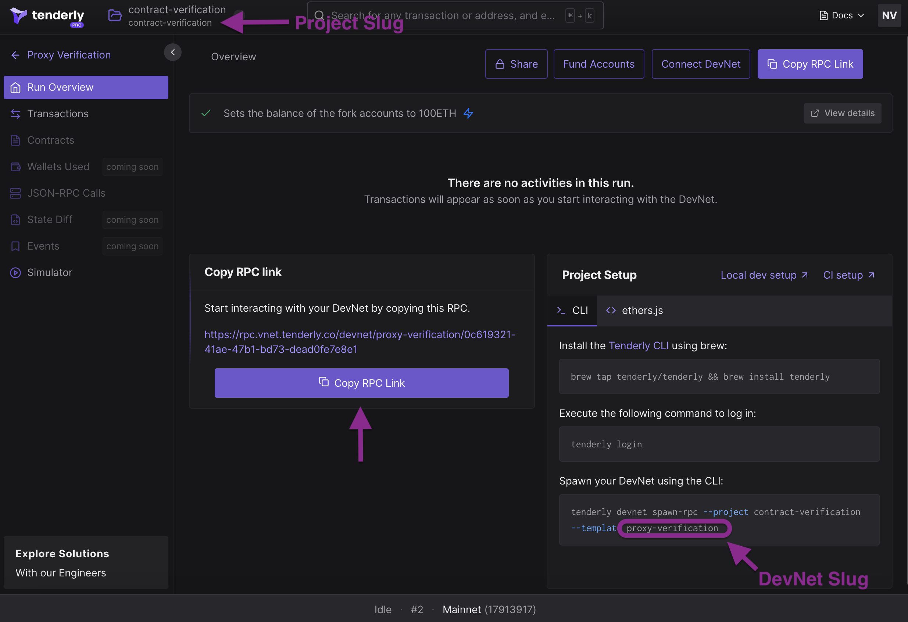

# Sample Hardhat Project

This project demonstrates smart Proxy Contracts verifications using Tenderly. You can find verifications of different proxy types in `tests/`.

## Setup

**Step 1**: install npm dependencies

```shell
cd contract-verifications-init
npm i
```

**Step 2**: To set up [Tenderly CLI](https://github.com/Tenderly/tenderly-cli):

```shell
brew tap tenderly/tenderly && brew install tenderly
tenderly login
```

**Step 3**: Introduce yourself in `hardhat.config.ts`
Modify your hardhat.config.ts file and update the `tenderly.username` and `tenderly.project` with your [username and project slug](https://docs.tenderly.co/other/platform-access/how-to-find-the-project-slug-username-and-organization-name).

**Step 4**: Create a DevNet
Go to Tenderly dashboard, and create a [new DevNet template](https://docs.tenderly.co/devnets/intro-to-devnets). Each time you run the tests, you can spawn a new DevNet and use the RPC.



**Step 5**: Spawn a DevNet from the template and use the RPC url:
Option 1: Click Spawn DevNet in the dashboard, and copying the RPC link to `networks.tenderly.url` in `hardhat.config.ts`.
Option 2: Run the devnet spawning command you copied from the dashboard and paste the link to `networks.tenderly.url` in `hardhat.config.ts`.
Option 3: Run the `spawn-devnet-to-hardhat` script from the example project, which will spin up a fresh DevNet and update your hardhat project use it automatically. Replace `PROJECT_SLUG` and `DEVNET_TEMPLATE_SLUG` with appropriate values (see the screenshot)

```bash
npm run spawn-devnet-to-hardhat <PROJECT_SLUG> <DEVNET_TEMPLATE_SLUG>
```
