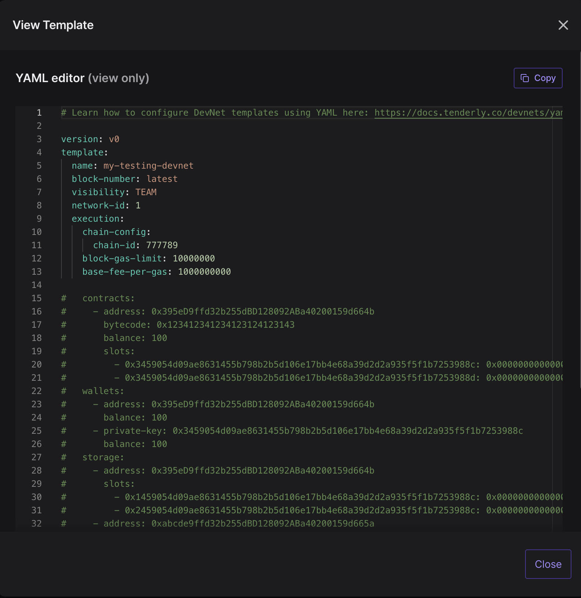

# Sample Hardhat Project

This project demonstrates deployment and testig of a simple Multisig wallet using Tenderly Fork as a development and testing network.

## Setup

### Step 1. Create a DevNet

Go to Tenderly dashboard > DevNets and click "Create a DevNet". [Find out more](https://docs.tenderly.co/devnets/setting-up-devnets-for-local-development).

### Step 2. Install dependencies

```bash
cd multisig-wallet
yarn
```

### Step 3. Set up environment variables

Run the following command to initialize an **.env** file for storing sensitive information (access keys, private keys etc.).

```bash
cp .tpl.env .env
```

1. Fill in `TENDERLY_PROJECT_SLUG` and `TENDERLY_USERNAME` in `.env` file. Follow this guide to [get project slug and username](https://docs.tenderly.co/other/platform-access/how-to-find-the-project-slug-username-and-organization-name)
2. Fill in `TENDERLY_ACCESS_KEY` in `.env` file. Follow this gude to [get Tenderly access key](https://docs.tenderly.co/other/platform-access/how-to-generate-api-access-tokens).
3. Optional: If running on a public testnet, provide 3 private keys to .env file (`SEPOLIA_PRIVATE_KEY_1`, `SEPOLIA_PRIVATE_KEY_2`, `SEPOLIA_PRIVATE_KEY_3`) and uncomment lines 30..33 in `hardhat.config.ts`.
4. Leave the rest unchanged for now

## Step 6: Run tests against the DevNet

Use the `tenderly:devnet:new` command to spawn a new devnet based on your template from step 1. It will update the .env file, in particular `TENDERLY_DEVNET_URL`, `TENDERLY_DEVNET_CHAIN_ID`.

1. Create a DevNet template. 
2. Copy DevNet slug and chain-id from YAML file
   
3. Run the following command to spin up a new devnet
   ```bash
   npm run tenderly:devnet:new my-project my-testing-devnet 1
                             # project   devnet template   chain-id
   ```
4. Run the tests
   ```bash
   npx hardhat test --network tenderly
   ```

## Step 4: Run the example

To try out the multisig, from deployment to executing an approved transaction, run the following script. It will use the fork as the network.

```bash
npx hardhat run scripts/run-deploy-submit-execute.ts --network tenderly
```

The script will:

- Deploy the Multisig to a Tenderly Fork
- Fund the Multisig smart contract
- Submit a Transaction to the Multisig
- Send 2 confirmations for the submitted transaction
- Execute the submitted transaction


### Granular usage:

To achieve the steps executed in `run-deploy-submit-execute.ts` separately, you can use the following procedure:

1. **Deploy the multisig** by running `npx hardhat run scripts/1-deploy-multisig.ts --network tenderly` and then
   1. Copy the address printed to console
   2. Paste it to `scripts/constants.ts` (scripts 2, 3, 4 will use `Deployments.MultisigWallet` for multisig wallet address)
2. **Fund the multisig** by running `npx hardhat run scripts/2-fund-multisig.ts --network tenderly`
3. **Submit a transaction** by running `npx hardhat run scripts/3-submit-tx.ts --network tenderly`
4. **Fund the multisig** by running `npx hardhat run scripts/4-execute-multisig-tx.ts --network tenderly`
